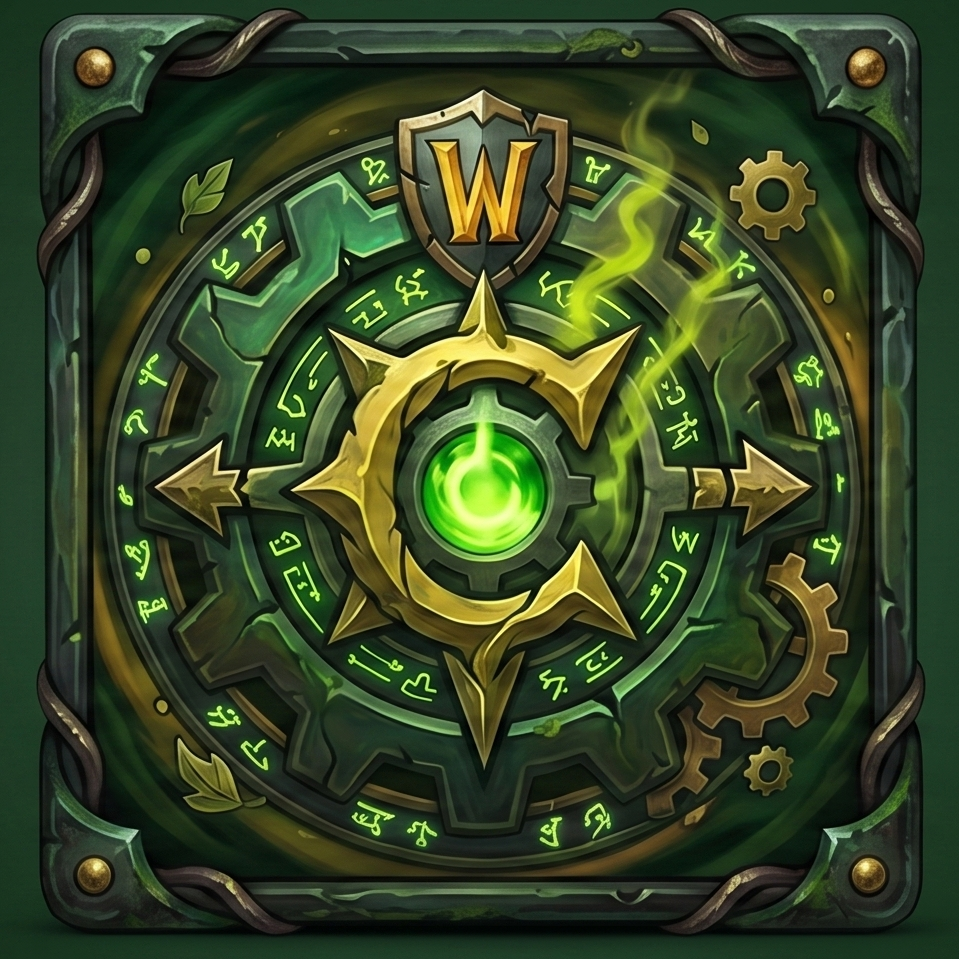

# ⚔️ WoW CFG Changer

<p align="center">
  
</p>

<p align="center"><i>C++ / ImGui</i></p>

Портирование идеи **Dota2CFGChanger** на WoW 3.3.5a — перенос настроек
(клиентские CVar, макросы, кейбинды, UI layout, SavedVariables аддонов)
между аккаунтами/реалмами/персонажами без ручного лазания по `WTF/`.

Тот же стек: **C++ / ImGui / GLFW**, портативный `.exe`, мгновенный запуск.

---

## Структура конфигов WoW (в отличие от плоской `570/` у Доты)

```
<WoW root>/WTF/Account/
    ACCOUNTNAME/
        config-cache.wtf        <- аккаунт-вайд CVar
        SavedVariables/         <- аддоны уровня аккаунта (WeakAuras и т.п.)
        REALMNAME/
            CHARACTERNAME/
                config-cache.wtf
                macros-cache.txt
                bindings-cache.wtf
                layout-local.txt
                edit-mode-cache-account.txt
                SavedVariables/  <- аддоны уровня персонажа (Details, TSM...)
```

Программа сканирует `WTF/Account/**`, строит дерево
**аккаунт → реалм → персонаж** и даёт выбрать источник/приёмник для копирования.

## Поддержка кириллицы

Ники вида `КтоТут` раньше превращались в `???????` — по двум причинам:

1. **Кодировка путей.** На Windows `std::filesystem::path::string()`
   конвертирует имена файлов через ANSI codepage процесса, а не UTF-8, и
   все не-ANSI символы теряются. Исправлено через `utf8_utils.h/.cpp` —
   явную конвертацию путь ⇄ UTF-8 (`WideCharToMultiByte`/
   `MultiByteToWideChar` на Windows, pass-through на Linux/macOS).

2. **Отсутствие глифов в шрифте.** Даже с корректной UTF-8-строкой ImGui
   рисует `?` вместо любого символа, для которого в загруженном шрифте нет
   глифа — а дефолтный шрифт ImGui содержит только Basic Latin. Первая
   версия фикса искала системный шрифт (Segoe UI и т.п.) в рантайме, но
   это ненадёжно — если поиск не находит файл (нестандартная система,
   песочница, права доступа), тихо остаётся latin-only шрифт и всё та же
   картина `??????????`.

   Решение: шрифт **DejaVu Sans** (полное покрытие кириллицы) зашит прямо
   в exe как сжатый byte-массив (`fonts/font_dejavu_sans.h`, сгенерирован
   через `binary_to_compressed_c` из репозитория Dear ImGui) и грузится
   через `AddFontFromMemoryCompressedBase85TTF` с диапазоном
   `GetGlyphRangesCyrillic()`. Теперь наличие кириллического шрифта вообще
   не зависит от того, что установлено на компьютере пользователя.

## ⚠️ Про фракцию, расу и класс (Horde/Alliance, race, class)

Клиент **не хранит фракцию/расу/класс локально** — это серверная
информация, WoW клиенту знать её не обязательно. Автодетект — эвристика:
программа грепает `SavedVariables/*.lua` персонажа на предмет полей вроде
`faction = "Horde"`, которые сохраняют некоторые аддоны (Auctioneer, TSM,
Details, Postal и т.д.). **Если на аккаунте нет ни одного из этих аддонов —
детект ничего не найдёт, это не баг, а честная граница возможностей
локального парсинга.**

Поэтому рядом с каждым персонажем есть кнопка **`...`** — открывает попап,
где фракция/раса/класс выставляются вручную (комбобоксы, раса зависит от
выбранной фракции). Один раз проставил — и это **сохраняется навсегда** в
файле `wowcfgchanger_meta.txt` рядом с exe (простой tab-separated текст,
UTF-8, ключ — аккаунт+реалм+ник). При следующих сканированиях ручные
данные автоматически подставляются поверх (и имеют приоритет над
эвристикой). Персонажи с ручным вводом помечаются `[Unknown]` без `?` —
`?` означает "детект не сработал", а не "точно неизвестно".

## 🖼 Иконка приложения

1. Сделай/сконвертируй свою иконку в `.ico` (лучше мульти-разрешение —
   16×16, 32×32, 48×48, 256×256 — чтобы не размывалась ни в трее, ни в
   Alt+Tab, ни в проводнике). Онлайн-конвертеры png→ico подойдут, либо
   ImageMagick: `magick convert icon.png -define icon:auto-resize=256,48,32,16 app_icon.ico`.
2. Положи файл в корень проекта под именем **`app_icon.ico`** (рядом с
   `CMakeLists.txt`).
3. Также сохрани **`app_icon.png`** (256×256 хватит) туда же — именно он
   показывается в шапке этого README на GitHub. `.ico` через `` в
   markdown иногда рендерится в низком разрешении (16×16) и выглядит
   мыльно, поэтому для превью репозитория используется отдельный `.png`.
4. Пересобери — всё остальное уже подключено:
   - `app.rc` встраивает иконку в ресурсы `.exe` под именем `GLFW_ICON`.
   - GLFW **сам** подхватывает ресурс с этим именем и ставит его и на
     иконку `.exe`/таскбара, и на иконку окна/заголовка — без единой
     строчки в `main.cpp`.
   - `CMakeLists.txt` уже компилирует `app.rc` через `windres`
     (`enable_language(RC)` + файл добавлен в `add_executable` для Windows).

Если иконки не появилось после ребилда — удали `cmake-build-*` и
перегенерируй проект (та же история, что и со сменой генератора выше):
резервный `.rc`-компилятор иногда не подхватывается на лету без чистого
конфигура.

## 💾 Запоминание пути и настроек

Путь к папке WoW теперь сохраняется автоматически при каждом успешном
сканировании в `wowcfgchanger_config.txt` рядом с exe (не с рабочей
директорией — используется реальная папка exe через `GetModuleFileNameW`,
так что путь сохраняется предсказуемо даже если запускать через ярлык с
другой "рабочей папкой"). При следующем запуске поле пути уже будет
заполнено — сканировать заново вручную не нужно.

## 🖥 Фиксированное окно

Окно теперь **не resizable** и стартует с разрешением **1280×800**,
по центру основного монитора. Раньше внутренняя раскладка ImGui каждый
кадр подстраивалась под размер OS-окна (`SetNextWindowSize(io.DisplaySize)`),
и из-за этого всё "гуляло" при любом растягивании — теперь размер окна
зафиксирован на уровне GLFW (`GLFW_RESIZABLE = false`), так что раскладка
внутри стабильна раз и навсегда. Если 1280×800 не подходит под твой
монитор — поменяй `kWindowWidth`/`kWindowHeight` в начале `main.cpp`.

## ℹ️ Кнопка "О программе"

В правом верхнем углу — иконка-кнопка. Если рядом с exe лежит
`app_icon.png` (см. раздел про иконку выше — нужен и `.ico` для сборки, и
отдельный `.png` для этой кнопки и README), кнопка покажет саму иконку;
если файла нет — просто текстовая кнопка `i`, приложение не падает.

По клику открывается попап: имя автора, дисклеймер **"если вы заплатили
за эту программу — вас обманули"**, и кнопка, открывающая GitHub-репозиторий
в браузере по умолчанию (`ShellExecute` на Windows / `xdg-open` на Linux).

Прежде чем собирать релиз — поправь `kCreatorName` и `kRepoUrl` в самом
начале `ui.cpp`: сейчас там плейсхолдеры на основе твоего
Dota2CFGChanger-репозитория, поменяй на актуальные для этого проекта.

## 🚀 Возможности

- **Автосканирование** `WTF/Account/` — находит все аккаунты, реалмы, персонажей.
- **Цветовая маркировка** фракции в списке (синий/красный/серый).
- **Diff-превью** сбоку — третья колонка показывает, что именно изменится
  при копировании (`NEW` / `OVERWRITE` / `unchanged`), до нажатия кнопки
  копирования. Пересчитывается только при смене выбора или галочек, не
  каждый кадр. Сравнение по размеру + времени изменения файла, без чтения
  содержимого (быстро, но это эвристика — не побайтовый diff).
- **Выборочное копирование**: клиентские настройки, макросы, кейбинды,
  UI layout, SavedVariables (отдельно — аккаунт-вайд / персонажа).
- **Создаёт папки назначения**, если персонаж/аккаунт ещё ни разу не логинился.
- **Portable**: один `.exe`, без установки.
- Все три колонки (source / dest / diff) и лог **растягиваются вместе с окном**.

## ⚠️ Позиции иконок на панели действий НЕ переносятся — и это не починить локально

Клиентские файлы (`config-cache.wtf`, `bindings-cache.wtf` и т.д.) хранят
**расположение и хоткеи панелей** (если использовать Bartender4/Dominos —
их скин и позиция на экране), но **какое конкретно заклинание/предмет
висит в слоте — это серверные данные**. WoW-клиент получает содержимое
панелей действий от сервера при логине (`SMSG_ACTION_BUTTONS`), в БД это
обычно таблица `character_action` (TrinityCore-подобные ядра). Локально
этой информации просто нет ни в одном файле `WTF/` — значит, никаким
копированием файлов её не перенести. Перенос потребовал бы прямого
доступа к базе данных сервера, что уже совсем другая задача (и не то,
что стоит делать без ведома администрации WoW Circle).

## 📥 Как пользоваться

1. Соберите (см. ниже) или скачайте `WowCFGChanger.exe`.
2. Укажите путь к папке игры (там, где `WTF/` и `Interface/`).
3. Нажмите **SCAN FOLDERS**.
4. Слева выберите **источник** (аккаунт целиком либо конкретного персонажа).
5. Справа выберите **приёмник**.
6. Отметьте, что копировать (галочки).
7. **COPY CONFIG NOW**.

## 🏗 Сборка

```bash
git clone <your-repo-url> WowCFGChanger
cd WowCFGChanger
cmake -S . -B build
cmake --build build --config Release
```

CMake сам подтянет GLFW и Dear ImGui через `FetchContent` — как и в
Dota2CFGChanger, никаких ручных vcpkg-плясок не требуется.

## Roadmap / что можно добавить

- [ ] ~~GitHub Actions workflow для авто-сборки Windows exe~~ — можно добавить позже, пока собираем локально.
- [x] ~~Ручной override фракции в UI~~ — сделано: кнопка `...` у каждого персонажа + фракция, раса, класс + персистентность в `wowcfgchanger_meta.txt`.
- [ ] Профили копирования (сохранить конкретный набор галочек как пресет).
- [x] ~~Diff-просмотр перед копированием~~ — сделано: третья колонка DIFF PREVIEW.
- [ ] Поддержка нескольких путей установки (если клиент не один).
- [x] ~~Запоминание последнего пути~~.
